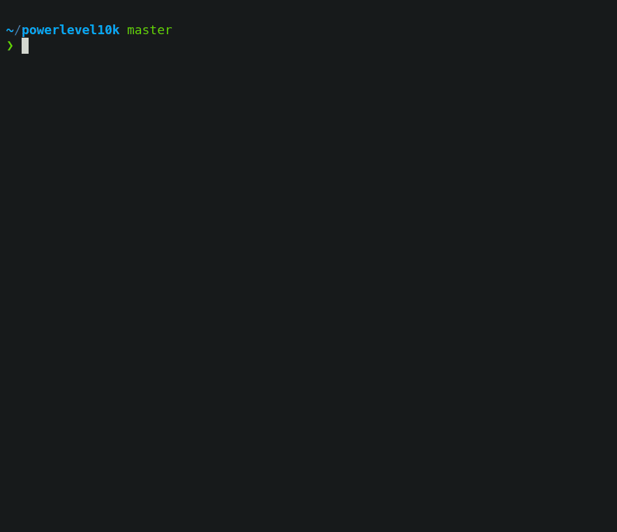

# iTerm2 Env Setup on Mac in 10 Minutes


GitHub repo: [https://github.com/JingGe/101](https://github.com/JingGe/101)


If you like the following iTerm2 style, you are at the right place. I will show you how to get this setup in 10 min.

.png>)

## Install ohmyzsh


sh -c "$(curl -fsSL [https://raw.githubusercontent.com/ohmyzsh/ohmyzsh/master/tools/install.sh](https://raw.githubusercontent.com/ohmyzsh/ohmyzsh/master/tools/install.sh))"


Reference: [https://github.com/ohmyzsh/ohmyzsh](https://github.com/ohmyzsh/ohmyzsh)

## Install Homebrew


/bin/bash -c "$(curl -fsSL [https://raw.githubusercontent.com/Homebrew/install/HEAD/install.sh](https://raw.githubusercontent.com/Homebrew/install/HEAD/install.sh))"


## Install iTerm2

The simplest way to install iTerm2 is to download and unzip it: [https://iterm2.com/downloads.html](https://iterm2.com/downloads.html)

## Install nerd-fonts

Clone the repo:


git clone [https://github.com/ryanoasis/nerd-fonts.git](https://github.com/ryanoasis/nerd-fonts.git)


Switch to the nerd-fonts folder and run:


./install.sh


## Install powerlevel10k

just clone the repo to the ohmyzsh themes folder:


git clone --depth=1 https://github.com/romkatv/powerlevel10k.git ${ZSH\_CUSTOM:-$HOME/.oh-my-zsh/custom}/themes/powerlevel10k


## Config .zshrc

change the theme to powerlevel10k:


ZSH\_THEME="powerlevel10k/powerlevel10k"


setup the plugins:


plugins=(git gitignore autojump wd docker zsh-autosuggestions zsh-syntax-highlighting)


### Install autojump


brew install autojump


After visiting directories, use `j -s` to check the weights:

.png>)

Use `j <dir>` to jump to a directory with highest weight:

.png>)

Find more by using:


j -h

jc -h

jco -h


### Install zsh-autosuggestions


git clone [https://github.com/zsh-users/zsh-autosuggestions](https://github.com/zsh-users/zsh-autosuggestions) ${ZSH\_CUSTOM:-\~/.oh-my-zsh/custom}/plugins/zsh-autosuggestions


### Install zsh-syntax-highlighting


git clone [https://github.com/zsh-users/zsh-syntax-highlighting.git](https://github.com/zsh-users/zsh-syntax-highlighting.git) ${ZSH\_CUSTOM:-\~/.oh-my-zsh/custom}/plugins/zsh-syntax-highlighting


Don't forget to call


source \~/.zshrc


## Configure Powerlevel10k

Now open a new iTerm and follow the wizard to configure the theme, if the wizard is not started automatically, type `p10k configure.`

Reference: [https://github.com/romkatv/powerlevel10k#oh-my-zsh](https://github.com/romkatv/powerlevel10k#oh-my-zsh)

## Clone iTerm2-Color-Schemes


`git clone`[`https://github.com/mbadolato/iTerm2-Color-Schemes.git`](https://github.com/mbadolato/iTerm2-Color-Schemes.git)``


Go to iTerm->Preferences->Profiles->Colors, you can import color schemes from iTerm2-Color-Schemes/scheme. I personally recommend "Chester".

.png>)

.png>)

Go to iTerm->Preferences->Profiles->Text, you can change the font

.png>)
