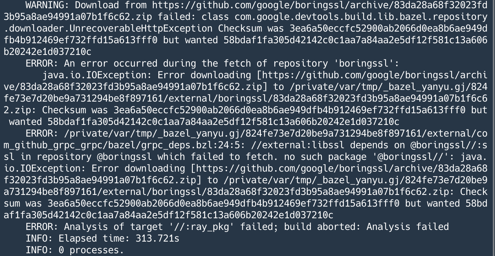

# Build Ray from the Source on Mac


GitHub repo: [https://github.com/JingGe/101](https://github.com/JingGe/101)


This doc will show you how to build a modern distributed system from the source. I will use the Ray-project as the example.&#x20;

The official document about this topic could be found at: [https://ray.readthedocs.io/en/latest/installation.html#building-ray-from-source](https://ray.readthedocs.io/en/latest/installation.html#building-ray-from-source)

As I followed the introduction, I have been running into many problems. This document will note down everything while building the Ray from the source. You will find some trouble shootings at the bottom of this doc.

## Checkout Ray

Chose a dir, for example \~/projects, and run:

> git clone [https://github.com/ray-project/ray.git](https://github.com/ray-project/ray.git)

## Install Bazel

Please refer to [https://docs.bazel.build/versions/master/install-os-x.html](https://docs.bazel.build/versions/master/install-os-x.html). It is easy enough to read. "Installing using binary installer" is recommended.

## Install Python

First of all, go to App Store, download Xcode and install it.

Then install the Homebrew:

> $ /usr/bin/ruby -e "$(curl -fsSL [https://raw.githubusercontent.com/Homebrew/install/master/install](https://raw.githubusercontent.com/Homebrew/install/master/install))"

Update the PATH:

> export PATH="/usr/local/opt/python/libexec/bin:$PATH"

Install python, pip should be installed together automatically:

> brew install python

## Setup Python Virtual env

Install the virtualenv:

> pip3 install virtualenv

Create a dir for python virtual env:

> mkdir pythonvenv
>
> cd pythonvenv

Within the dir, create the venv. At the time of this writing, Ray just released 0.8.0, The source is built with python 3.6:

> virtualenv --no-site-packages --python=python3.6 venv\_github\_ray\_36

Activate the venv. BTW, the command for stopping the virtual env is "deactivate"

> source ./venv\_github\_ray\_36/bin/activate

Check if virtual env is active:

> which python

The output should be something like: \~/projects/pythonvenv/venv\_github\_ray\_36/bin/python

## Preparing the build

Install some prerequisite tools:

> pip install cython==0.29.0 setuptools\_scm numpy six tensorflow==1.7.1 pyhocon

## Build Ray

Now use the same terminal and go the ray/python dir and run:

> pip install -e . --verbose

## Trouble Shooting

### Python version

If you see errors like:

> ERROR: Could not find a version that satisfies the requirement tensorflow==1.7.1 (from versions: 1.13.0rc1, 1.13.0rc2, 1.13.1, 1.13.2, 1.14.0rc0, 1.14.0rc1, 1.14.0, 1.15.0rc0, 1.15.0rc1, 1.15.0rc2, 1.15.0rc3, 1.15.0, 2.0.0a0, 2.0.0b0, 2.0.0b1, 2.0.0rc0, 2.0.0rc1, 2.0.0rc2, 2.0.0, 2.1.0rc0, 2.1.0rc1, 2.1.0rc2) ERROR: No matching distribution found for tensorflow==1.7.1

Please check your python version. Maybe you are using python 3.7. Current build only supports python 3.6.&#x20;

### Pyarrow Download Issue

If your build is blocked while downloading the pyarrow from [https://s3-us-west-2.amazonaws.com/arrow-wheels/3a11193d9530fe8ec7fdb98057f853b708f6f6ae/index.html](https://s3-us-west-2.amazonaws.com/arrow-wheels/3a11193d9530fe8ec7fdb98057f853b708f6f6ae/index.html), you might have network issue. Try download pyarrow-0.14.0.RAY-cp36-cp36m-macosx\_10\_6\_intel.whl from the s3 page and run:

> pip install -q --target="\~/projects/github/ray/python/ray/pyarrow\_files" pyarrow==0.14.0.RAY --find-links \~/Download/pyarrow-0.14.0.RAY-cp36-cp36m-macosx\_10\_6\_intel.whl --upgrade

run the following script the skip download the pyarrow again while runnig the build script:

> export SKIP\_PYARROW\_INSTALL=true

### Boringssl with Checksum Error

If you see something like this:



Please go to ray dir and run:

> bazel build ray\_pkg

This build sould be failed and you should see some output like:&#x20;

```
WARNING: Download from https://github.com/google/boringssl/archive/83da28a68f32023fd3b95a8ae94991a07b1f6c62.zip failed: class javax.net.ssl.SSLProtocolException Read timed out
```

Which shows that there is a network issue. Try to use a proxy.

### Local Dependencies Installation

If you installed some dependencies on your local mac, e.g. boost, you may run into some cpp build issues. Please make sure either uninstall it or keep the installed version as same as the version used in bazel/ray\_deps\_setup.bzl.
